# VybePixie — Architecture

> Deep dive into the event-sourced, deterministic 3D asset creation engine

---

## Table of Contents

- [System Overview](#system-overview)
- [Design Principles](#design-principles)
- [Application Layers](#application-layers)
- [Event-Sourcing Core](#event-sourcing-core)
- [12-Phase Engine](#12-phase-engine)
- [Frontend Architecture](#frontend-architecture)
- [AI Generation Pipeline](#ai-generation-pipeline)
- [DCC Bridge System](#dcc-bridge-system)

---

## System Overview

VybePixie is a **Tauri hybrid desktop application** with three distinct runtime layers:

1. **Rust Container** (Tauri) — Native OS integration, security sandboxing, file system access
2. **React Frontend** — Professional 3D editing UI with Three.js viewport
3. **Python Engine** — Event-sourced core, AI generation pipeline, DCC bridges

```
┌─────────────────────────────────────────────────────────┐
│                    User's Desktop                        │
├─────────────────────────────────────────────────────────┤
│                                                          │
│  ┌───────────────────────────────┐                      │
│  │     Tauri Container (Rust)    │                      │
│  │  • Security sandbox           │                      │
│  │  • File I/O                   │                      │
│  │  • Native dialogs             │                      │
│  │  • IPC bridge                 │                      │
│  └──────────────┬────────────────┘                      │
│                 │                                        │
│     ┌───────────┴───────────┐                           │
│     ▼                       ▼                            │
│  ┌──────────────┐   ┌──────────────────────────┐       │
│  │ React + Three│   │  Python Engine            │       │
│  │              │   │                            │       │
│  │ • WebGL      │   │  Event Store (SQLite)      │       │
│  │ • 10+ panels │   │  12-Phase System           │       │
│  │ • Redux      │   │  AI Pipeline (PyTorch)     │       │
│  │ • Workspace  │   │  DCC Bridges               │       │
│  └──────────────┘   └──────────────────────────┘       │
│                                                          │
│  ┌──────────────────────────────────────────────┐       │
│  │              GPU Layer                        │       │
│  │  • WebGL (viewport rendering)                 │       │
│  │  • CUDA/PyTorch (AI generation)               │       │
│  └──────────────────────────────────────────────┘       │
│                                                          │
└─────────────────────────────────────────────────────────┘
```

---

## Design Principles

| Principle | Implementation |
|-----------|---------------|
| **Determinism** | Same input → same output, guaranteed by canonical serialization + versioned hashing |
| **Event Sourcing** | All state derived from immutable event stream; current state = replay of events |
| **Content Addressing** | Every entity identified by SHA-256 hash of its canonical bytes |
| **Tamper Evidence** | Blockchain-style prev_hash + current_hash chaining in event ledger |
| **Non-Destructive** | Edits are layers, not mutations; full undo history preserved |
| **Phase Isolation** | 12 independent systems with clear boundaries and contracts |

---

## Event-Sourcing Core

The foundation of VybePixie. Every state change in the application is driven by an immutable event.

### How It Works

```
User Action (e.g., "generate mesh from prompt")
    │
    ▼
┌──────────────────────────────────────┐
│  1. Validate Input                    │
│     • Schema validation (Pydantic)    │
│     • Business rule checks            │
└──────────────┬───────────────────────┘
               │
               ▼
┌──────────────────────────────────────┐
│  2. Create Event                      │
│     • Deterministic ID (SHA-256)      │
│     • Canonical JSON serialization    │
│     • Compute event hash              │
│     • Chain to previous event hash    │
└──────────────┬───────────────────────┘
               │
               ▼
┌──────────────────────────────────────┐
│  3. Store in Event Ledger (SQLite)    │
│     • Append-only (no updates)        │
│     • Hash chain maintained           │
│     • Snapshot checkpoints for speed  │
└──────────────┬───────────────────────┘
               │
               ▼
┌──────────────────────────────────────┐
│  4. Replay to Derive State            │
│     • Sequential event replay         │
│     • Deterministic state rebuilding  │
│     • Snapshot-accelerated for perf   │
└──────────────────────────────────────┘
```

### Hash Chain Integrity

```
Event 1              Event 2              Event 3
┌──────────────┐    ┌──────────────┐    ┌──────────────┐
│ prev: null   │    │ prev: hash_1 │    │ prev: hash_2 │
│ data: {...}  │    │ data: {...}  │    │ data: {...}  │
│ hash: hash_1 │───→│ hash: hash_2 │───→│ hash: hash_3 │
└──────────────┘    └──────────────┘    └──────────────┘
```

If any event is tampered with, all subsequent hashes break — making unauthorized changes immediately detectable.

---

## 12-Phase Engine

The Python backend is organized into 12 independent phases, each handling a distinct domain:

```mermaid
graph LR
    P0[Phase 0<br>Core] --> P1[Phase 1<br>World]
    P1 --> P2[Phase 2<br>Assets]
    P2 --> P3[Phase 3<br>Edits]
    P3 --> P4[Phase 4<br>Planning]
    P4 --> P5[Phase 5<br>Generation]
    P5 --> P6[Phase 6<br>Assembly]
    P6 --> P7[Phase 7<br>Validation]
    P7 --> P8[Phase 8<br>Fixes]
    P8 --> P9[Phase 9<br>Procedural]
    P9 --> P10[Phase 10<br>Director]
    P10 --> P11[Phase 11<br>Ingestion]
    P11 --> P12[Phase 12<br>Bridges]
```



### Phase Details

| Phase | Module | Responsibility |
|-------|--------|---------------|
| **0** | `core/` | Determinism foundation — hashing, content-addressed IDs, event types, ledger, replay engine, logical time |
| **1** | `world/` | Scene graph — hierarchical nodes, transforms, spatial queries, world model |
| **2** | `assets/` | Content-addressable asset registry — versioning, provenance tracking, metadata |
| **3** | `edits/` | Non-destructive edit system — operations, layers, undo/redo history |
| **4** | `planning/` | Agent planning — budgets, task decomposition, approval workflows |
| **5** | `generation/` | AI generation pipelines — model invocation, cost tracking, quality validation |
| **6** | `assembly/` | Scene assembly — LOD management, asset linking, deterministic composition |
| **7** | `validation/` | 50+ validation rules — geometry checks, material validation, budget enforcement |
| **8** | `fixes/` | Auto-fix engine — intelligent corrections, governance gates, retry policies |
| **9** | `procedural/` | 50+ algorithms — noise, SDFs, L-systems, scatter, heightmaps, curves |
| **10** | `director/` | LLM orchestration — intent parsing, creative direction, multi-provider routing |
| **11** | `ingestion/` | Data import — attribution tracking, gap detection, format conversion |
| **12** | `bridges/` | DCC integration — Blender, Maya, Houdini bi-directional sync |

### Module Layout

```
src/vybepixie/
├── core/                    # Phase 0
│   ├── events/             # Event types, ledger, replay
│   ├── state/              # State reconstruction, snapshots
│   ├── hashing/            # Deterministic SHA-256
│   ├── ids/                # Content-addressed identifiers
│   ├── invariants/         # Determinism verification
│   └── time/               # Logical timestamps
├── world/                  # Phase 1 — Scene graph
├── assets/                 # Phase 2 — Asset registry
├── edits/                  # Phase 3 — Edit system
├── planning/               # Phase 4 — Planning
├── generation/             # Phase 5 — AI pipelines
├── assembly/               # Phase 6 — Scene composition
├── validation/             # Phase 7 — Quality control
├── fixes/                  # Phase 8 — Auto-fix
├── procedural/             # Phase 9 — Procedural generation
├── director/               # Phase 10 — LLM orchestration
├── ingestion/              # Phase 11 — Data import
├── bridges/                # Phase 12 — DCC bridges
│   ├── blender/           # Blender 3.0–4.5
│   ├── maya/              # Maya 2018–2025
│   └── houdini/           # Houdini
├── ai_generation/          # Self-hosted AI model runners
├── animation_runtime/      # Animation playback system
├── rigging/               # Character rigging
├── material_system/       # PBR materials (50+ presets)
├── characters/            # Character generation
├── physics_foundation/    # Physics simulation (cloth, rigid body)
├── security/              # RBAC, audit, secrets
└── api_services/          # REST/GraphQL/WebSocket APIs
```

---

## Frontend Architecture

### UI Panel System

```
App (Tauri windowed container)
├── MenuBar (File, Edit, View, Help)
├── Toolbar (Quick actions, view mode toggles)
├── Viewport (Three.js WebGL canvas)
├── Dockable Panels:
│   ├── SceneGraphPanel     — Hierarchy tree
│   ├── PropertiesPanel     — Transform, metadata inspector
│   ├── TimelinePanel       — Animation sequencing
│   ├── AssetBrowserPanel   — Content library
│   ├── AIChatPanel         — Natural language interface
│   ├── ConsolePanel        — Real-time logs
│   ├── ValidationPanel     — Quality dashboard
│   ├── MeshEditorPanel     — Geometry editing
│   ├── StoryboardPanel     — Cinematic planning
│   └── MultiplayerPanel    — Collaboration
└── Workspaces (preset configurations):
    ├── Director    — Cinematic/animation focus
    ├── Assets      — 3D asset creation focus
    ├── Validation  — QA review focus
    └── Export      — Final output focus
```

### State Management

| Store | Library | Scope |
|-------|---------|-------|
| **Global UI** | Redux Toolkit | Panel layout, viewport state, selection |
| **Persistence** | Redux Persist | Survive app restarts |
| **Local state** | Zustand | Component-scoped lightweight stores |
| **Immutable updates** | Immer | Safe nested state mutations |

### 3D Rendering Pipeline

- **React Three Fiber** — Declarative Three.js in React components
- **React Three Drei** — Camera controls, gizmos, presets, helpers
- **WebGL 2.0** — Hardware-accelerated 3D rendering
- **Picking & Gizmos** — Interactive object selection and manipulation in viewport

---

## AI Generation Pipeline

```
User Prompt / Input Image
    │
    ▼
┌────────────────────────────────┐
│  Director (Phase 10)           │
│  • Parse intent via LLM        │
│  • Decompose into gen steps    │
│  • Estimate cost/budget        │
└───────────┬────────────────────┘
            │
            ▼
┌────────────────────────────────┐
│  Model Orchestrator            │
│  • Select appropriate model    │
│  • Manage GPU memory           │
│  • Queue generation jobs       │
│  • Cache intermediate results  │
└───────────┬────────────────────┘
            │
            ▼
┌────────────────────────────────┐
│  Generation Models             │
│  ├── Shap-E (text-to-3D)      │
│  ├── Point-E (point clouds)   │
│  ├── TripoSR (single-image)   │
│  ├── InstantMesh (multi-view) │
│  ├── SDXL (textures)          │
│  ├── ControlNet (guided)      │
│  └── FLUX (materials)         │
└───────────┬────────────────────┘
            │
            ▼
┌────────────────────────────────┐
│  Post-Processing               │
│  • Mesh optimization           │
│  • LOD generation              │
│  • UV unwrapping               │
│  • Material assignment         │
│  • Rigging (if character)      │
└───────────┬────────────────────┘
            │
            ▼
┌────────────────────────────────┐
│  Validation (Phase 7)          │
│  • 50+ quality checks          │
│  • Budget verification         │
│  • Auto-fix if needed          │
│  • Event recorded to ledger    │
└────────────────────────────────┘
```

### Supported AI Providers

| Provider | Models | Use Case |
|----------|--------|----------|
| Self-hosted | PyTorch models | Full local control, no cloud dependency |
| OpenAI | GPT-4, DALL-E | Creative direction, texture concepts |
| Anthropic | Claude | Complex planning, code generation |
| Google | Gemini | Multi-modal understanding |
| xAI | Grok | Alternative reasoning |

All providers support automatic fallback chains — if one fails, the next in line takes over.

---

## DCC Bridge System

### Architecture

```
VybePixie Engine
    │
    ├──── Blender Bridge (Phase 12)
    │     • Python addon in Blender
    │     • Socket-based IPC
    │     • Supports Blender 3.0 – 4.5
    │     • Bi-directional mesh/material sync
    │
    ├──── Maya Bridge
    │     • MEL/Python plugin
    │     • Supports Maya 2018 – 2025
    │     • Studio-standard pipeline integration
    │
    └──── Houdini Bridge
          • Procedural workflow integration
          • HDA (Houdini Digital Asset) support
```

### Format Support

| Format | Type | Direction |
|--------|------|-----------|
| **GLTF/GLB** | Mesh + Materials | Import / Export |
| **USDZ** | Universal Scene | Import / Export |
| **FBX** | Mesh + Animation | Import / Export |
| **OBJ** | Mesh | Import / Export |
| **VRM** | Character | Export |
| **USD** | Universal Scene | Import / Export |
| **Point Cloud** | Raw geometry | Import |

---

*This document describes the architectural design of VybePixie. The source code is proprietary and not publicly available.*

**© 2024-2026 DevStudio AI. All rights reserved.**
